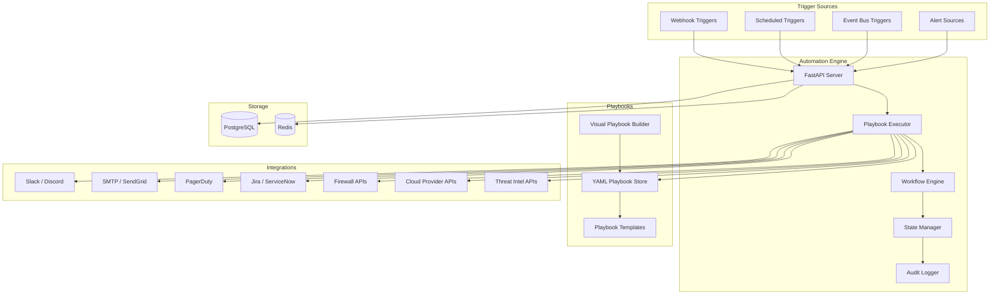

<p align="center">
  
  
  
  
  
  
</p>

<p align="center">
  <b>SOAR-Like Security Automation Platform</b><br/>
  Automated incident response playbooks, Slack/Discord/email integrations, and visual workflow builder.
</p>

---

## 📋 Description

**Kirov Cyber Automation Engine** is a Security Orchestration, Automation, and Response (SOAR) platform that empowers security teams to automate incident response workflows. It provides a visual playbook builder, 50+ pre-built integration actions, and a flexible YAML-based playbook engine that connects security tools across your stack.

When a security alert fires anywhere in the Kirov ecosystem — whether it's a critical vulnerability, a cloud misconfiguration, or a phishing campaign — the Automation Engine executes the appropriate response playbook: isolating compromised instances, blocking IOCs at the firewall, notifying the incident response team, opening Jira tickets, and documenting the entire response timeline.

---

## 🏗️ Architecture



---

## ✨ Key Features

- **📋 Visual Playbook Builder** — Drag-and-drop workflow editor for creating incident response playbooks without coding
- **⚡ Real-Time Execution** — Sub-second playbook trigger response with parallel action execution
- **🔌 50+ Built-in Integrations** — Slack, Discord, Teams, Email (SMTP/SendGrid), PagerDuty, Jira, ServiceNow, GitHub, GitLab, AWS, Azure, GCP, Cloudflare, Okta, CrowdStrike, SentinelOne, Palo Alto, and more
- **📝 YAML Playbook Format** — Human-readable playbook definitions with version control built-in
- **🔄 Conditional Logic** — Branching, loops, parallel execution, and wait-for-condition patterns
- **🧩 Custom Action SDK** — Build your own integration actions with Python SDK
- **📊 Execution Audit** — Complete execution trace with timing, inputs, outputs, and error handling for compliance
- **🛡️ Approval Gates** — Manual approval steps for high-impact actions (instance isolation, credential rotation)
- **⏱️ Scheduled Playbooks** — Cron-based triggers for recurring security tasks (log rotation, compliance checks)
- **🌐 Webhook Receiver** — Accept webhooks from any source to trigger playbooks
- **🔒 Role-Based Access** — Granular permissions for playbook creation, editing, execution, and approval

---

## 🛠️ Tech Stack

| Category | Technology |
|----------|-----------|
| **Backend** | FastAPI 0.110+ (Python 3.11+) |
| **Workflow Engine** | Temporal.io / Celery |
| **Playbook Format** | YAML 1.2 with custom schema |
| **Frontend** | React 18 + TypeScript (Vite, React Flow) |
| **Database** | PostgreSQL 16 |
| **Cache** | Redis 7 |
| **Message Queue** | RabbitMQ |
| **Containerization** | Docker, Docker Compose |
| **Monitoring** | Prometheus, Grafana |
| **Secret Store** | HashiCorp Vault (optional) |
| **Auth** | OAuth 2.0 / OIDC via Kirov Secure Auth |

---

## 🚀 Quick Start

### Prerequisites

- Python 3.11+, Docker and Docker Compose
- Node.js 18+ (for frontend development)

### Installation

```bash
# Clone the repository
git clone https://github.com/Raphasha27/kirov-cyber-automation-engine.git
cd kirov-cyber-automation-engine

# Copy environment configuration
cp .env.example .env
# Edit .env with your integration API keys

# Start with Docker Compose
docker compose up -d

# Or run locally:
cd server
python -m venv venv
source venv/bin/activate  # Windows: venv\Scripts\activate
pip install -r requirements.txt
uvicorn app.main:app --reload --port 8000
```

### Create Your First Playbook

Create a file `playbooks/incident-response/block-ip.yaml`:

```yaml
name: Block Malicious IP
description: Automatically block a malicious IP across firewall and cloud WAF
trigger:
  type: webhook
  event: ip.block.request
steps:
  - name: Validate IP
    action: util.validate_ip
    input:
      ip: "{{ event.ip }}"
  - name: Block at Firewall
    action: firewall.create_rule
    input:
      ip: "{{ event.ip }}"
      action: deny
      ttl: 86400
    on_failure: notify_soc
  - name: Block Cloud WAF
    action: cloud.create_waf_rule
    input:
      ip: "{{ event.ip }}"
      provider: "{{ event.cloud_provider }}"
  - name: Notify SOC
    action: slack.send_message
    input:
      channel: "#soc-alerts"
      message: "Blocked IP {{ event.ip }} across {{ event.cloud_provider }}"
    wait_for: [block_firewall, block_waf]
  - name: Create Ticket
    action: jira.create_issue
    input:
      project: "SOC"
      summary: "Automated IP block: {{ event.ip }}"
      description: "IP was automatically blocked by Kirov Automation Engine"
```

### Register and Trigger the Playbook

```bash
# Register playbook
curl -X POST http://localhost:8000/api/v1/playbooks \
  -H "Content-Type: application/yaml" \
  --data-binary @playbooks/incident-response/block-ip.yaml

# Trigger via webhook
curl -X POST http://localhost:8000/api/v1/triggers/webhook/ip.block.request \
  -H "Content-Type: application/json" \
  -d '{"ip": "203.0.113.42", "cloud_provider": "aws"}'
```

---

## 📡 API Overview

| Endpoint | Method | Description |
|----------|--------|-------------|
| `/api/v1/health` | GET | Health check |
| `/api/v1/playbooks` | GET/POST | List/create playbooks |
| `/api/v1/playbooks/:id` | GET/PUT/DELETE | Playbook CRUD |
| `/api/v1/playbooks/:id/execute` | POST | Execute playbook |
| `/api/v1/executions` | GET | Execution history |
| `/api/v1/executions/:id` | GET | Execution details |
| `/api/v1/integrations` | GET | List configured integrations |
| `/api/v1/integrations/:type/configure` | POST | Configure integration |
| `/api/v1/triggers` | GET | List registered triggers |
| `/api/v1/triggers/webhook/:event` | POST | Webhook trigger endpoint |
| `/api/v1/actions` | GET | List available actions |

---

## 🔗 Integration with Kirov Ecosystem

| Component | Integration |
|-----------|-------------|
| **[Security Dashboard](https://github.com/Raphasha27/kirov-security-dashboard)** | Displays playbook execution status and SOAR metrics |
| **[AI Security Assistant](https://github.com/Raphasha27/kirov-ai-security-assistant)** | Triggers remediation playbooks on critical vulnerability findings |
| **[Cloud Security Monitor](https://github.com/Raphasha27/kirov-cloud-security-monitor)** | Auto-remediation playbooks for cloud misconfigurations |
| **[Threat Hunter](https://github.com/Raphasha27/kirov-threat-hunter)** | Triggers containment playbooks on IOC matches |
| **[Phishing Detection](https://github.com/Raphasha27/kirov-phishing-detection-engine)** | Auto-block phishing domains and notify affected users |
| **[Network Defense](https://github.com/Raphasha27/kirov-network-defense-platform)** | Automated firewall rule updates based on IDS/IPS alerts |

---

## 🔒 Security Considerations

- **Approval Gates**: Critical actions (instance shutdown, credential rotation, data deletion) require manual approval
- **Secrets Management**: Integration credentials stored in encrypted vault with HashiCorp Vault or AWS Secrets Manager
- **Playbook Validation**: All YAML playbooks are validated against a strict schema before deployment
- **Execution Isolation**: Each playbook execution runs in an isolated sandbox with resource limits
- **Audit Trail**: Immutable execution logs with complete input/output capture for compliance
- **Rate Limiting**: Prevent runaway playbooks with configurable rate limits and execution timeouts
- **Circuit Breaker**: Automatic halt if a playbook causes unexpected infrastructure changes

---

## 🗺️ Roadmap

- [ ] **Q3 2026** — AI-generated playbook recommendations based on incident type and environment
- [ ] **Q3 2026** — Community playbook marketplace with shared workflows
- [ ] **Q4 2026** — ChatOps-native playbook execution via Slack commands
- [ ] **Q4 2026** — Automated playbook testing and dry-run mode
- [ ] **Q1 2027** — Multi-step approval workflows with delegated authority
- [ ] **Q1 2027** — Post-incident auto-report generation with timeline reconstruction

---

## 📄 License

This project is licensed under the **MIT License** — see the [LICENSE](LICENSE) file for details.

## 🙏 Attribution

Created and maintained by **Kirov Security Labs** — the research and development division of Kirov, dedicated to advancing AI-driven cybersecurity solutions.

<br/>

---

<p align="center">
  <sub>🔒 <a href="https://github.com/Raphasha27">Raphasha27</a> Security Ecosystem — <a href="https://github.com/Raphasha27/Raphasha27">Back to Profile</a></sub>
</p>

<p align="center">
  <sub>Automate response. Reduce dwell time. Protect faster.</sub>
</p>
